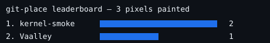

# git-place

A perpetual pixel canvas whose permanent record is this git repo. r/place, but the
database is `state/board.json`, the only writer is a GitHub Action, and the input
device is the issue tracker — plus a live WebRTC layer for painting with friends
in real time.




## How it works

```
live layer (ephemeral)                durable layer (this repo)
┌──────────────────────────┐          ┌────────────────────────────────┐
│ /site client (Pages)     │ publish  │ issue "[sync]" + ops payload   │
│ paint + WebRTC mesh      ├─────────►│ or "[paint] x,y,#rrggbb"       │
└──────────────────────────┘          └───────────────┬────────────────┘
                                                      ▼
                                      Action: validate → applyOp (LWW CRDT)
                                      → commit board.json + ops.jsonl
                                      → regenerate assets/*.svg → close issue
```

Every write is a CRDT operation (`{x, y, c, ts, p}`). Concurrent writes from issues
and live sessions commute — last-writer-wins per pixel on `(timestamp, peer)` — so
the Action can merge anything, in any order, with zero conflicts. `git log` of
`state/ops.jsonl` is a full timelapse of the canvas.

## Place a pixel (async)

Open an issue titled **`[paint] 12,40,#ff8800`** (x, y, color; board is 64×64,
coords 0–63). The Action paints it, regenerates the board above, and closes the
issue with a confirmation. [Issue template](.github/ISSUE_TEMPLATE/paint.md) provided.

## Paint live (WebRTC)

Open **`/site/`** on this repo's GitHub Pages deployment. One person clicks
*Host session* and shares the offer blob; friends paste it under *Join session*
and hand back their answer blobs. From then on, pixels sync peer-to-peer in real
time — no server. The host (or anyone, for solo painting) hits **Publish** to
persist the session buffer: it opens a pre-filled `[sync]` issue, and the Action
merges it into the permanent record.

## Setup

1. Push this repo to GitHub.
2. Settings → Pages → deploy from branch `main`, root `/` (client is at `/site/`).
3. Settings → Actions → General → Workflow permissions: **Read and write**
   (the workflow commits the board back).
4. Replace `YOUR-USER/git-place` defaults: pass `?repo=owner/repo` to `/site/`
   or let the client prompt once.

## Layout

See [docs/CONTRACT.md](docs/CONTRACT.md) — formats, the `lib/crdt.js` API, and the
issue conventions everything binds to.
